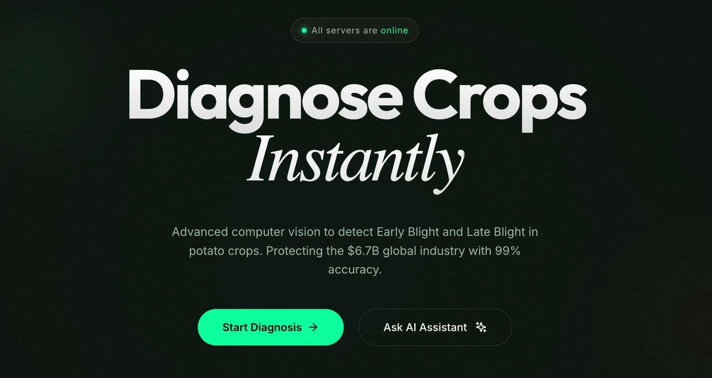
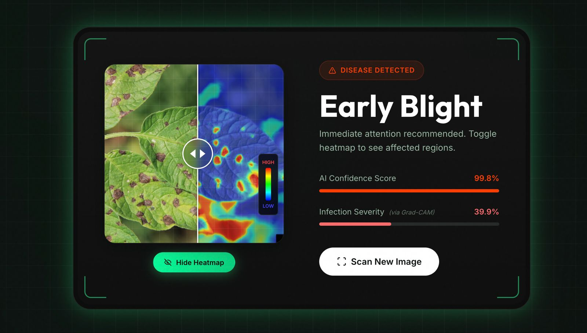
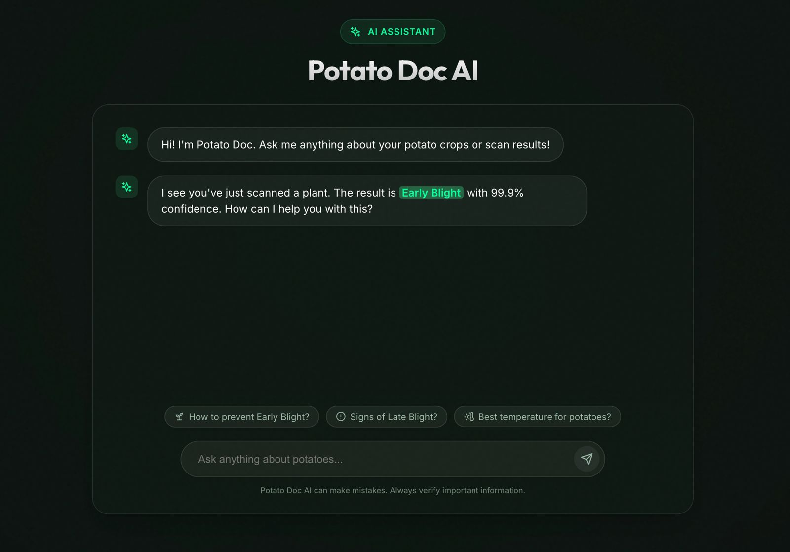

# Potato Doc – Accessible Precision Agriculture
<p align="center">
  
</p>

<p align="">
  <strong>An Explainable AI (XAI) and GenAI-Powered Platform for Quantitative Plant Disease Diagnosis and Automated Severity Estimation.</strong>
</p>

<p align="">
  A Major Project Report submitted in partial fulfillment of the requirements for the degree of Bachelor of Technology
  by <strong>Satwik Singh (22U03036)</strong> and <strong>Arpit Raj (22U03034)</strong>
</p>

---

## Project Overview

**Potato Doc** represents a paradigm shift in agricultural technology, evolving from a simple detection prototype into a comprehensive **AgroSaaS (Software as a Service)** platform. It bridges the critical gap between "Black Box" deep learning and practical agronomy by introducing **Explainable AI (XAI)** to visualize decision-making and **Semantic Segmentation** to quantify disease severity.

Unlike traditional tools that offer binary "Healthy/Diseased" outputs, Potato Doc provides a **Severity Index**, enabling farmers to make precise, data-driven decisions on pesticide dosage. Furthermore, it integrates a **Retrieval-Augmented Generation (RAG)** chatbot powered by **Google Gemini 2.5 Pro**, which grounds its advice in verified agricultural literature to eliminate hallucinations and provide context-aware, expert guidance.

---

## The Evolution: From Prototype to Enterprise SaaS

This Major Project marks a significant architectural and functional leap from our previous work.

| Feature | Minor Project (Prototype) | Major Project (AgroSaaS Platform) |
| :--- | :--- | :--- |
| **Core Task** | Simple Image Classification | **Quantitative Analysis & Severity Estimation** |
| **AI Model** | Standard CNN (Black Box) | **Explainable AI (XAI)** with Grad-CAM Visualization |
| **Output** | Single Label (e.g., "Late Blight") | Diagnosis + **Severity Index (%)** + **Heatmap Overlay** |
| **User Guidance** | Static, Hardcoded Text | **RAG-Based GenAI Chatbot** (Context-Aware & Grounded) |
| **Architecture**| Monolithic Script | **Decoupled Microservices** (Frontend, API Gateway, ML Inference) |
| **Deployment** | Manual / Localhost | **Automated CI/CD Pipeline** (GitHub Actions -> Vercel/Docker) |

---

## Core Features

### Trustworthy AI with Grad-CAM (XAI)

Farmers often distrust AI because they cannot see *why* a decision was made. We implemented **Gradient-weighted Class Activation Mapping (Grad-CAM)** to generate visual heatmaps.
*   **Benefit:** Users can see exactly which part of the leaf the model focused on (e.g., the fungal lesion vs. the background), validating the model's reliability.

<p align="center">
  
</p>

### Precision Severity Index

Knowing a plant is sick is not enough; knowing *how* sick it is determines the treatment.
*   **Innovation:** We utilize **Semantic Segmentation** techniques to isolate diseased pixels and calculate the exact percentage of leaf area infection.
*   **Impact:** Prevents over-spraying of chemicals, saving costs and protecting the environment.

### RAG-Based GenAI Agronomist

We moved beyond simple LLM wrappers. Our chatbot utilizes a **Retrieval-Augmented Generation (RAG)** pipeline.
*   **Mechanism:** When a user asks a question, the system retrieves relevant context from a vector database of agricultural handbooks and feeds it to **Google Gemini 2.5 Pro**.
*   **Result:** The AI acts as an expert agronomist, providing advice that is specific to the diagnosed disease and grounded in scientific fact, significantly reducing "hallucinations."

### Enterprise-Grade MLOps

We adopted industry-standard **DevOps** practices to ensure scalability.
*   **CI/CD:** Automated pipelines via **GitHub Actions** ensure that every code push is tested and deployed without downtime.
*   **Microservices:** The frontend (React), backend (FastAPI), and ML engine are decoupled, allowing independent scaling.

---

## System Architecture

The project is architected as a modern, cloud-native application:

*   **Frontend (Client-Side):**
    *   Built with **React 18** and **Framer Motion** for a fluid, app-like experience.
    *   Handles real-time image processing and heatmap rendering.
    *   Hosted on **Vercel**'s global edge network.

*   **Backend (API Gateway):**
    *   A high-performance **FastAPI (Python)** service acting as the orchestration layer.
    *   Manages the **RAG Pipeline**: Embedding user queries, searching the vector store, and prompting the Gemini LLM.
    *   Deployed as **Serverless Functions** to handle burst traffic efficiently.

*   **AI Inference Engine:**
    *   The heavy-lifting CNN and Segmentation models are hosted on **Hugging Face Spaces**, exposing a REST API for inference.
    *   This separation of concerns ensures the lightweight API remains fast while the GPU-intensive tasks run on dedicated hardware.

<p align="center">
  
</p>

---

## Technology Stack

| Category | Technologies |
| :--- | :--- |
| **Frontend** | React, JavaScript, Axios, Framer Motion, Tailwind CSS |
| **Backend** | Python, FastAPI, Uvicorn |
| **Generative AI** | **Google Gemini 2.5 Pro**, LangChain (RAG), Vector Embeddings |
| **Computer Vision** | TensorFlow/Keras, OpenCV, **Grad-CAM (XAI)**, NumPy |
| **DevOps & Cloud** | **Docker**, **GitHub Actions (CI/CD)**, Vercel, Hugging Face Spaces |
| **Dataset** | PlantVillage (Augmented & Annotated) |

---

## DevOps & CI/CD Pipeline

To ensure reliability and rapid iteration, we have implemented a robust **Continuous Integration/Continuous Deployment (CI/CD)** pipeline using **GitHub Actions**.

### Pipeline Stages
1.  **Frontend Integration:**
    *   Installs dependencies and runs **ESLint** for code quality.
    *   Executes **Unit Tests** to verify component logic.
    *   Builds the production-ready React bundle.
2.  **Backend Analysis:**
    *   Sets up the Python environment and installs dependencies.
    *   Runs **Flake8** for PEP8 compliance and syntax checking.
    *   Executes **Pytest** suites to verify API endpoints.
3.  **Security Scanning (DevSecOps):**
    *   Runs **Trivy** filesystem scans to detect vulnerabilities in dependencies before deployment.
4.  **Automated Deployment:**
    *   Upon passing all checks, the code is automatically handed off to **Vercel** for zero-downtime deployment.

---

## Getting Started

### Prerequisites

*   Node.js (v18+)
*   Python (v3.9+)
*   `pip` & `virtualenv`
*   Google Gemini API Key

### Installation & Setup

1.  **Clone the repository:**
    ```bash
    git clone https://github.com/ssatwik975/potato-doc.git
    cd potato-doc
    ```

2.  **Frontend Setup:**
    ```bash
    cd frontend
    npm install
    npm start
    ```
    *Access the UI at `http://localhost:3000`*

3.  **Backend API Setup:**
    ```bash
    cd ../api
    python -m venv venv
    source venv/bin/activate  # Windows: venv\Scripts\activate
    pip install -r requirements.txt
    ```
    *Create a `.env` file with `GOOGLE_API_KEY=your_key_here`*
    ```bash
    uvicorn main:app --reload --port 8000
    ```

---

## Future Scope (Phase 2)

*   **Mobile Native:** Developing a React Native application for offline-first field usage in remote areas.
*   **IoT Integration:** Connecting the SaaS backend to Raspberry Pi-based soil moisture sensors for multi-modal prediction (Image + Soil Data).

---

## License

This project is licensed under the MIT License. See the [LICENSE](LICENSE) file for details.


